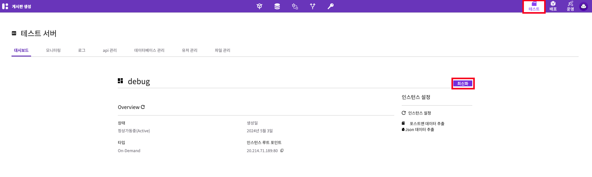
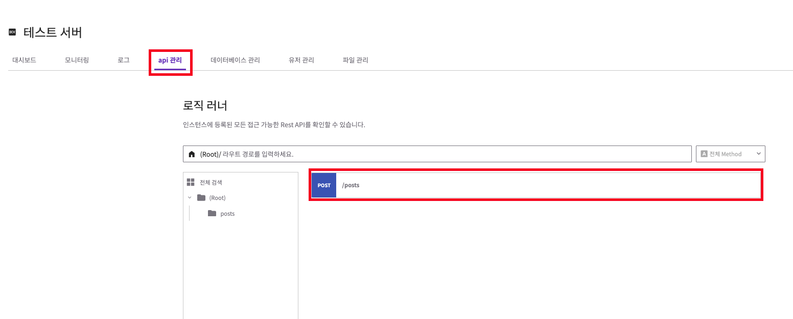
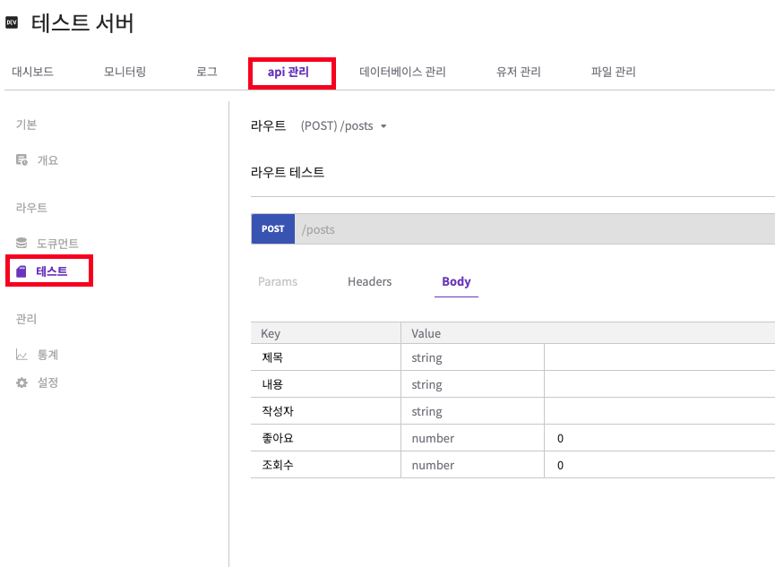
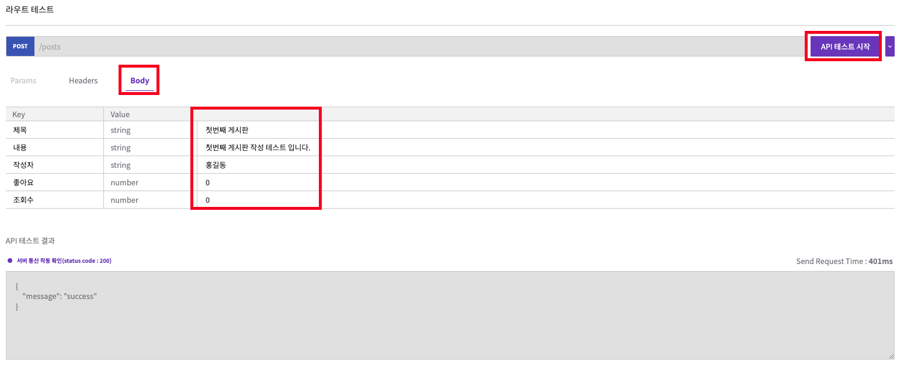

# Quickstart

회원가입 프로젝트 로그인 서버키트는 쉽고 빠르게 백앤드 개발을 도와줄수 있는 놀라운 도구 입니다.

이 섹션에서는 간단한 예제를 통해 ServerKit의 주요 기능을 빠르게 배울 수 있는 방법을 함께 진행해 보겠습니다.&#x20;

게시판 글을 하나를 만들어보도록 하겠습니다.

## 사전준비

### 회원가입, 로그인

먼저 서버키트를 이용하려면 회원가입을 해야 합니다.

회원가입 버튼을 클릭해서 서버키트를 사용할 계정을 생성 후 로그인 합니다.

회원가입이 완료되면 자동으로 로그인이 됩니다

<figure><figcaption>
회원가입 영상
</figcaption></figure>

<figure><figcaption>
로그인 영상
</figcaption></figure>

### 데이터 구조 구상

어떤 데이터 구조에 어떤 데이터를 채워 넣을 것인지 미리 구상해 두면 좋습니다.

서버키트는 여러분이 구상한 데이터 구조를 쉽게 작성 할 수 있게 도와줍니다.

이 섹션에서는 게시판 글을 하나를 생성해 보겠습니다.

게시글은 제목과, 내용, 좋아요, 조회횟수, 작성자 가 필요할 것 같아 보이는군요.

제목, 내용, 작성자는 문자 타입이 적합해 보입니다. 그리고 좋아요, 조회횟수는 숫자 타입이면 좋을것 같습니다.

계속 진행해 보겠습니다.

## Step 1: 새 프로젝트 생성

새프로젝트 생성을 클릭 후 프로젝트 이름을 작성합니다.&#x20;

<figure><figcaption></figcaption></figure>

원하는 색상이나 설명을 입력하면 향후 프로젝트 관리에 도움이 됩니다.

<figure><figcaption></figcaption></figure>

## Step 2: Data Design

### 스키마 작성

우선 데이터 구조를 디자인 합니다.

우리는 데이터 구조를 스키마 라고 부릅니다.

스키마는 스킴키트 메뉴로 들어가면 만들 수 있습니다.

스킴키트는 일반 문자 타입 부터 이메일 같은 고급 타입까지 다양한 타입을 지원합니다.

게시판에 필요한 데이터 구조를 만들어 보겠습니다.

<figure><figcaption></figcaption></figure>

원하는 타입을 필드로 Drag and Drop 해서 아주 편하게 스키마를 만들 수 있습니다.

앞서 구상한 대로 데이터 구조를 하나하나 만듭니다.

<figure><figcaption></figcaption></figure>

제목, 게시물 내용, 작성자는 문자 (String)타입으로 만듭니다.

좋아요 숫자와, 조회 숫자는 숫자(Number)타입으로 만듭니다.

### 데이터 베이스 생성

다음은 데이터를 사용할 실제 데이터베이스를 만들어 보겠습니다.

데이터베이스는 우리가 만든 데이터 구조를 이용해서 실제로 데이터를 저장하는 DB 입니다.

데이터베이스 생성은 DB키트메뉴에 들어가서 만들 수 있습니다.

<figure><figcaption></figcaption></figure>

인제 만든 게시판 데이터 구조를 사용하기 위해 DB키트로 이동해서 새 데이터베이스 생성을 클릭해줍니다. 차례대로 이름, 설명을 적는 기본 정보 설정을 해준 다음을 클릭 합니다.

디자인 선택에서 SchemeKit에서 만든 게시판 데이터 구조를 선택합니다.&#x20;

<figure><figcaption></figcaption></figure>

데이터 베이스를 작성하는 단계는 기본정보 설정 부터 완료까지 크게 4단계 입니다.

&#x20;1단계(기본정보 설정)에서 이름과 설명을 입력합니다.

&#x20;2단계(디자인 선택)에서 작성해 둔 스키마를 선택 합니다.

지금은 이정도면 충분합니다. 빠르게 완료단계로 넘어갑니다.

최종에서 완료를 누르면 새로운 데이터베이스가 생성됩니다.

<figure><figcaption></figcaption></figure>

이제 데이터베이스에 새로운 데이터를 채워 넣을 수 있게 되었습니다.

## Step 3: Business Logic

데이터베이스에 데이터를 채워 넣으려면,

어떤 데이터를 받아서 어떻게 채워 넣을 것인지 로직을 작성해야 합니다.

쉽고 빠른 로직 작성을 도와주는 기능 역시 서버키트에서 제공합니다.

바로 로직키트 입니다.&#x20;

<figure><figcaption></figcaption></figure>

로직키트는 간단한 마우스 키보드 조작만드로 쉽게 로직을 작성할 수 있게 도와줍니다.

로직키트 메뉴로 이동 후 새로운 로직을 만들기 위해 + 버튼을 클릭합니다.

로직키트에서 각 로직의 핵심이 되는 부분을 우리는 노드 라고 부릅니다.

<figure><figcaption></figcaption></figure>

예를 들어서 로직의 시작과 끝을 우리는 startNode 와 endNode 로 표현할 수 있습니다.

startNode 에는 로직보드에서 받는 데이터를 입력 할수 있습니다.&#x20;

사전단계에서 구상했던, 어떻게 데이터를 받을지를 결정하는 부분이 될수 있습니다.

endNode 에는 로직보드의 실행 결과를 입력 할 수 있습니다.

게시물 하나를 만드는데 필요한 노드는 총 6개입니다.&#x20;

pin(노드들의 맨 위에 달려있는 flow로 회색 선)에 따라 순서대로 설명드리도록 하겠습니다.

<figure><figcaption></figcaption></figure>

### 1. Start 노드

Start 노드에서 모든게 시작됩니다. 첫 시작을 하는 노드이기 때문에 지금과 같이 제목, 내용, 좋아요, 조회, 작성자를 만드면 클라이언트로부터 저 데이터들을 받겠다는 의미가 됩니다.&#x20;

한개의 로직에는 1개의 시작 노드가 존재합니다.

### 2. postCrate 모듈

Start 노드 다음으로 연결되어져 있는게 postCate라는 이름의 모듈입니다.&#x20;

노드와 모듈의 차이는 뒤에서 따로 다루도록 하겠습니다.&#x20;

이 모듈에서는 데이터를 데이터베이스에 채워 넣을 수 있도록 도와줍니다.

그리고 어떤 데이터베이스(=database)에 어떤 내용(=data)을 넣을지 핀으로 연결 하거나, 입력을 하면 동작합니다.

먼저 databasc 핀에 DBKit에서 만든 게시판 데이터베이스를 연결은 3번과 이어집니다.

### 3. DB 노드

<figure><figcaption>
로직키트 데이터베이스
</figcaption></figure>

해당 노드를 먼저 보드에 추가하기 위해서는 왼쪽 메뉴에 있는  데이터베이스를 클릭, 검색되는 데이터베이스를 보드에 Drag and Drop 하면 됩니다.

DB 노드는 DB의 Id 뿐만 아니라 Schecm의 Id도 제공하지만 현재 게시글을 하나 작성하는데 필요하지 않기 때문에 두개의 pin 중에 첫번째 pin인 DB Id를  postCreate 모듈의 왼쪽 pin의 첫번째에 연결해줍니다.

### 4. Object Constructor

postCreate에 어떤 데이터베이스를 연결할 지 알려줬다면 인제는 어떤 데이터들을 넣어줄지 알려줘야 합니다. 이미 데이터베이스를 연결했기 때문에 Object Constructor 노드를 연결시켜주면 동적으로 Scheme으로 정의한 구조들이 나옵니다. 이를 Start Node에 곧바로 연결하면 클라이언트로부터 모든 데이터를 받겠다는 의미가 됩니다.

### 5. End 노드 - 성공할 경우와&#x20;

End Node는 Start Node와 반대되는 노드입니다. 끝을 의미하는 End 노드는 그 결과값을 클라이언트에게 전달합니다.&#x20;

postCeate의 경우 콜백이 2개입니다. 성공일 경우 succese로 5번째 End 노드로 이동합니다. result의 값은 게시글이 데이터베이스에 저장되었다는 성공 코드가 나옵니다.&#x20;

### 6. End 노드 - 실패할 경우

위와 달리 실패할 경우 fail로 6번째 노드에 이동합니다. result의 값은 실패의 원인이 나옵니다.&#x20;

<figure><figcaption>
로직키트 스냅샷
</figcaption></figure>

보드 작성이 완료했다면 스냅샷을 생성해야 합니다.

스냅샷을 생성하면 로직이 정상 작동하는지 기본적인 점검을 수행 합니다.

그리고 라우트에서 로직을 연결 해서 사용할 수 있게 됩니다.

왼쪽 메뉴 탭에서 빌드를 클릭 보드를 컴파일 후 빌드 생성을 클릭하여 스냅샷 하나를 생성해줍니다.

## Step 4: Endpoint 설정

### 라우터 생성

라우터란 외부에서 우리가 만든 로직에 접근할수 있는 창구라고 생각하면 됩니다. 즉, API 라고 할 수 있습니다.

서버키트에서는 라우터키트를 통해서 라우터를 쉽게 작성 할 수 있습니다.

라우트 키트로 이동하여 라우트 생성을 클릭합니다.&#x20;

<figure><figcaption>
라우터키트 생성
</figcaption></figure>

<figure><figcaption></figcaption></figure>

<figure><figcaption></figcaption></figure>

먼저 메서드를 선택합니다.

<figure><figcaption></figcaption></figure>

게시글을 하나 만들것이기 때문에 post 메서드를 선택하겠습니다.

그리고 엔드포인트는 /posts 로 작성해 주겠습니다.

다음은 작성한 로직을 선택하겠습니다.

이전 스텝에서  만든 로직의 스냅샷을 선택합니다.

<figure><figcaption></figcaption></figure>

그래고 생성 버튼을 클릭하면 로직에 연결된 라우트 1개가 생성이 됩니다.

### 테스트

이제 실제로 배포를 하기 이전에 우리가 만든 로직과, 라우트가 잘 작동하는지 테스트를 해보겠습니다.

서버키트는 아주 간편하게 사용할 수 있는 배포 기능을 제공합니다.

배포하기를 클릭하기만 하면 RouterKit에 있는 라우트가 모두 배포됩니다.&#x20;

배포하기 이전에 실제로 잘 작동하는지 테스트를 먼저 해보겠습니다.

테스트 메뉴를 클릭 후 최신화 버튼을 클릭합니다.

현재 라우트키트 에 있는 라우트를 모두 테스트 할수 있게 됩니다.

<figure><figcaption></figcaption></figure>

테스트를 진행하기 위해 api 관리 탭으로 들어갑니다.&#x20;

<figure><figcaption></figcaption></figure>

이전단계에서 작성한 api 를 선택합니다. 후 테스트 메뉴로 들어갑니다.

배포한 api 가 잘 작동하는지 테스트를 할 수 있습니다.

<figure><figcaption></figcaption></figure>

라우터에서 작성한 body 값을 입력후 API 테스트 시작 버튼을 클릭 합니다.&#x20;

<figure><figcaption></figcaption></figure>

테스트가 성공했습니다.&#x20;

데이터 구조 작성(스킴키트) 부터 로직러너(api 테스트)까지 전반적인 기능을 이용해서 게시글을 작성해 보았습니다.

게시판 글 작성 기능을 만드는데 채 5분 도 걸리지 않은것 같군요.

서버키트를 이용하면 게시판 글 작성 부터 업데이트, 삭제, 조회까지 매우 쉽게 기능을 만들 수 있습니다.

***

## 다음 단계

ServerKit을 이용해 게시판에 들어갈 게시물 하나를 만드는 간단한 예제를 진행해봤습니다. 가능한 다른 기능을 탐색할 차례입니다.

* 각 서비스의 자세한 설명은 가이드를 참조하세요.
* 구축을 시작할 때 사용 정책을 염두에 두세요.

