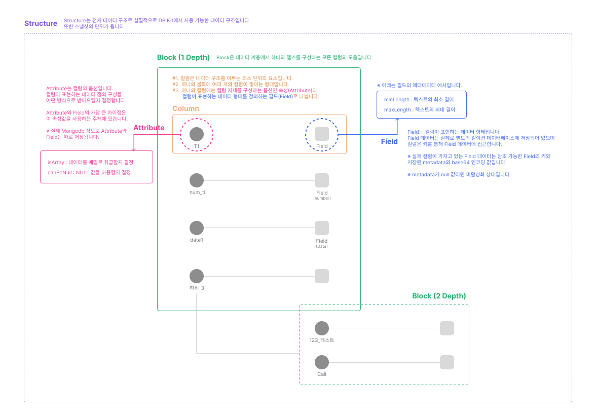

# Design

## 개요

디자인은 Scheme Kit 서비스에서 작성 가능한 데이터베이스의 데이터 구조입니다.

Tree 형식의 데이터로 구성되며 각 데이터를 구성하는 컬럼(Column)이라는 정보가 1개 이상 모인 모임입니다.

사용자는 이 Column 데이터를 쌓아 전체적인 데이터의 형태를 구성하게 되며 이 Column에는 제약사항, 속성, 데이터의 타입을 선택할 수 있습니다.

<figure><figcaption>
디자인의 구조
</figcaption></figure>
